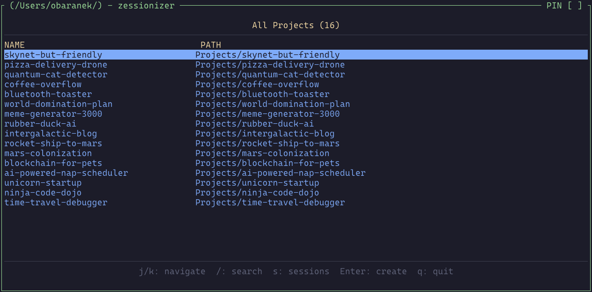
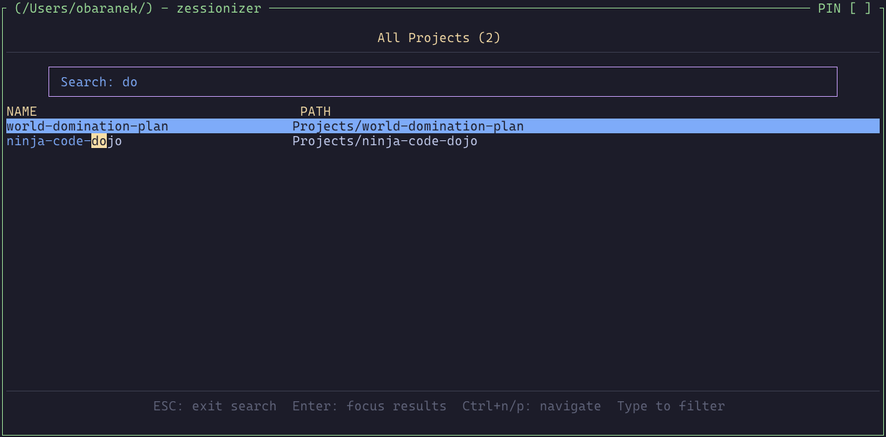
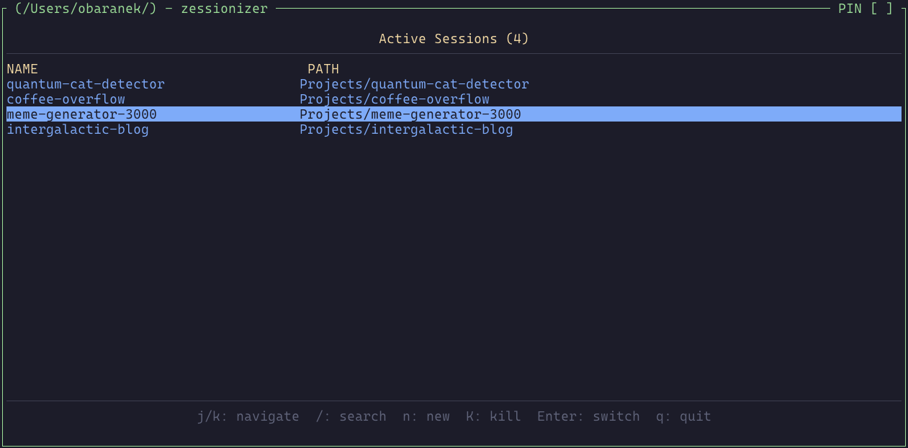

# Zessionizer

A **Project Session Manager** for [Zellij](https://zellij.dev) with VIM-like keybindings. Zessionizer provides fuzzy-searchable project switching with intelligent frecency-based ranking, automatic project discovery (Git repositories and `.zessionizer` marker files), and seamless session management.

## Screenshots

<p align="center">
  
  
  
</p>

<p align="center">
  <em>Projects Mode</em>
  &nbsp;&nbsp;&nbsp;&nbsp;&nbsp;&nbsp;&nbsp;&nbsp;&nbsp;&nbsp;&nbsp;&nbsp;&nbsp;&nbsp;&nbsp;&nbsp;
  <em>Search Mode</em>
  &nbsp;&nbsp;&nbsp;&nbsp;&nbsp;&nbsp;&nbsp;&nbsp;&nbsp;&nbsp;&nbsp;&nbsp;&nbsp;&nbsp;&nbsp;&nbsp;
  <em>Sessions Mode</em>
</p>

## Features

- **Real-time Project Discovery**: Automatically detects new/modified projects via filesystem events
- **Frecency-Based Ranking**: Projects you use frequently and recently appear at the top
- **Fuzzy Search**: Quickly find projects by typing partial names
- **VIM-like Navigation**: Navigate with `j`/`k`, search with `/`, quit with `q`
- **Session Management**: Create, switch, and kill Zellij sessions directly from the plugin
- **Persistent State**: JSON file storage maintains project history and rankings
- **Asynchronous Processing**: Background worker threads keep the UI responsive

## Installation

### Prerequisites

1. **Zellij** (v0.43.1 or later)
2. **Rust toolchain** with WASM support

### Step 1: Install Rust WASM Target

```bash
rustup target add wasm32-wasip1
```

### Step 2: Build and Install Plugin

```bash
# Clone the repository
git clone https://github.com/obaranek/zessionizer.git
cd zessionizer

# Build and install
make install
```

The plugin will be installed to `~/.config/zellij/plugins/zessionizer.wasm`.

## Configuration

Add Zessionizer to your Zellij configuration file at `~/.config/zellij/config.kdl`:

### Basic Configuration

First, define the plugin in the `plugins` section:

```kdl
plugins {
    zessionizer location="file:~/.config/zellij/plugins/zessionizer.wasm" {
        scan_paths "~/Projects"
        cwd "/Users/johndoe"
    }
}
```

Then reference it in your keybindings:

```kdl
keybinds {
    session {
        bind "p" {
            LaunchOrFocusPlugin "zessionizer" {
                floating true
                move_to_focused_tab true
            }
            SwitchToMode "normal"
        }
    }
}
```

### Full Configuration with Options

Define the plugin with all available options:

```kdl
plugins {
    zessionizer location="file:~/.config/zellij/plugins/zessionizer.wasm" {
        // Comma-separated paths to scan for Git repositories
        scan_paths "~/Projects,~/Work,~/Code"

        // Maximum directory depth for recursive scanning (default: 4)
        scan_depth "4"

        // Built-in theme (optional)
        // Options: catppuccin-mocha, catppuccin-latte,
        //          catppuccin-frappe, catppuccin-macchiato
        theme "catppuccin-mocha"

        // Working directory for the plugin (required)
        cwd "/Users/johndoe"

        // Tracing level for debugging (optional)
        // Options: trace, debug, info, warn, error
        // trace_level "debug"
    }
}
```

Then reference it in your keybindings:

```kdl
keybinds {
    session {
        bind "p" {
            LaunchOrFocusPlugin "zessionizer" {
                floating true
                move_to_focused_tab true
            }
            SwitchToMode "normal"
        }
    }
}
```

### Configuration Options

| Option         | Type   | Default               | Description |
|----------------|--------|-----------------------|-------------|
| `scan_paths`   | String | `"~/Projects"`        | Comma-separated paths to scan for projects (Git repositories and `.zessionizer` marker files) |
| `scan_depth`   | String | `"4"`                 | Maximum directory depth for scanning (1-10 recommended) |
| `cwd`          | String | -                     | Full path of working directory for the plugin. Ex: `/Users/johndoe` |
| `theme`        | String | `"catppuccin-mocha"` | Built-in theme name |
| `theme_file`   | String | -                     | Path to custom TOML theme file (overrides `theme`) |
| `trace_level`  | String | -                     | Tracing level: trace, debug, info, warn, error |

## Usage

### Opening the Plugin

Press `Alt o` to enter session mode, then press `p` to open Zessionizer.

### Keybindings

#### Global Keybindings (Work in All Modes)

| Key | Action |
|-----|--------|
| `Ctrl+n` | Move down in the list |
| `Ctrl+p` | Move up in the list |

#### Normal Mode

| Key | Action |
|-----|--------|
| `j` / `Down` | Move down in the list |
| `k` / `Up` | Move up in the list |
| `Enter` | Select project (switch to existing session or create new) |
| `/` | Enter search mode |
| `n` | Show projects view |
| `s` | Show sessions view |
| `K` (Shift+k) | Kill selected session |
| `q` | Close plugin |
| `Esc` | Close plugin |

#### Search Mode

| Key | Action |
|-----|--------|
| Any character | Type to filter projects |
| `Backspace` | Delete last character |
| `Enter` | Select project (or exit search if no selection) |
| `Esc` | Exit search mode |
| `/` | Return to search input |

### Workflow

1. **Open Zessionizer**: Press `Alt o` then `p`
2. **Find a Project**:
   - Type `/` to search
   - Type part of the project name (fuzzy matching)
   - Use `Ctrl+n`/`Ctrl+p` to navigate results in search mode
   - Press `Enter` to switch to the selected session
3. **Select Project**: Press `Enter`
   - If a session exists: switches to it
   - If no session exists: creates a new one
   - If in search mode with no results: exits to Project mode
4. **Manage Sessions**: Press `s` to view active sessions
   - Press `K` to kill a session

## How It Works

### Frecency Algorithm

Zessionizer ranks projects using a **frecency** algorithm that combines:

- **Frequency**: How often you access a project
- **Recency**: When you last accessed it

This means your most-used and recently-used projects always appear at the top.

### Project Discovery

Zessionizer automatically discovers projects through real-time filesystem monitoring:

1. **Permission request** - Plugin requests filesystem and command execution permissions on startup
2. **Initial scan** - After permissions granted, scans configured paths for existing projects
3. **Real-time monitoring** - Filesystem events automatically detect new/modified/deleted projects
4. Each scan searches configured paths for:
   - Directories containing a `.git` folder (Git repositories)
   - Directories containing a `.zessionizer` marker file (non-Git projects)
5. Discovered projects are:
   - Stored in a local JSON file (`~/.local/share/zellij/zessionizer/projects.json`)
   - Ranked by frecency score (frequency + recency)
   - Automatically added without duplicates

**Tip:** To track a non-Git directory as a project, simply create an empty `.zessionizer` file in that directory:
```bash
touch /path/to/your/project/.zessionizer
```

### Session Management

When you select a project:

- Zessionizer checks if a session with that name exists
- If yes: switches to the existing session
- If no: creates a new session with the working directory set to the project path

## Development

### Building

```bash
make build      # Build the WASM binary
make check      # Verify the code compiles
make clippy     # Run linter
make test       # Run tests
make fmt        # Format code
```

### Project Structure

```
zessionizer/
├── src/
│   ├── main.rs          # Zellij plugin entry point
│   ├── lib.rs           # Library root
│   ├── app/             # Application logic and state machine
│   ├── domain/          # Domain models (Project, errors)
│   ├── infrastructure/  # Platform utilities
│   ├── storage/         # JSON file persistence layer
│   ├── worker/          # Background worker for async operations
│   └── ui/              # Terminal UI rendering
├── Cargo.toml
├── Makefile
└── README.md
```

### Debugging

Enable tracing by adding `trace_level` to your config:

```kdl
LaunchOrFocusPlugin "file:~/.config/zellij/plugins/zessionizer.wasm" {
    floating true
    trace_level "debug"
}
```

Traces are written to `~/.local/share/zessionizer/zessionizer-otlp.json` in OTLP JSON format.

## Uninstalling

```bash
make uninstall
```

To also remove the storage data:

```bash
rm -rf ~/.local/share/zellij/zessionizer
```

## Contributing

Contributions are welcome! Please:

1. Fork the repository
2. Create a feature branch
3. Make your changes
4. Run tests: `make test`
5. Format code: `make fmt`
6. Run linter: `make clippy`
7. Submit a pull request

## License

MIT License - see LICENSE file for details

## Acknowledgments

- [Zellij](https://zellij.dev) - Terminal workspace and multiplexer
- Inspired by [tmux-sessionizer](https://github.com/ThePrimeagen/.dotfiles/blob/master/bin/.local/scripts/tmux-sessionizer) by ThePrimeagen
- Built with [Rust](https://www.rust-lang.org/)
